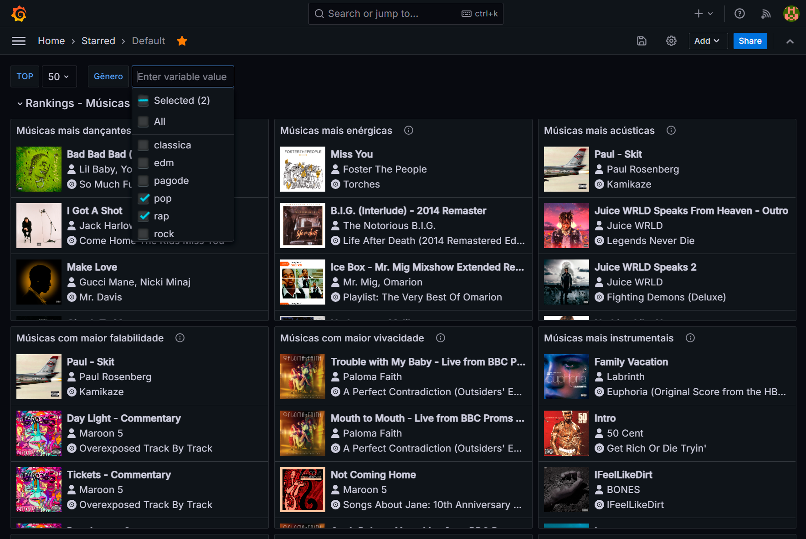

Este repositório contém código criado para explorar as etapas do processo de ETL em um dataset obtido através da Web API do Spotify.

## Ferramentas
* Python 3.12
* PostgreSQL 16
* Grafana OSS 11.3

Compatibilidade não garantida com versões diferentes das citadas.

## Dependências
Os scripts em Python dependem das bibliotecas [Pandas](https://pandas.pydata.org/) e [Spotipy](https://spotipy.readthedocs.io/), que podem ser instaladas através do pip:

```pip install pandas spotipy```

O dashboard criado no Grafana depende do plugin [Business Text](https://volkovlabs.io/plugins/business-text/), que pode ser instalado pela ferramenta de linha de comando do Grafana:

```grafana cli plugins install marcusolsson-dynamictext-panel```

Adicionalmente, algumas funcionalidades dos painéis do dashboard exigem que a configuração [disable_sanitize_url](https://grafana.com/docs/grafana/v11.3/setup-grafana/configure-grafana/#disable_sanitize_html) seja habilitada na instalação do Grafana.

## Execução
Os scripts devem ser executados na seguinte ordem, pois dependem dos dados gerados pelos passos anteriores:

1. **Extração:** executada a partir do [crawler.py](extract/crawler.py). Inicia com a extração de playlists (`crawler.py -p playlists.json`), em seguida são extraídos os álbuns das playlists (`crawler.py -a playlist_{}`) e depois as faixas contidas nos álbuns das playlists (`crawler.py -d playlist_{}`). Após esses passos, as features de cada faixa devem ser extraídas (`crawler.py -f playlist_{} album_tracks_playlist_{}`).

2. **Transformação:** com os dados obtidos na etapa anterior, devem ser executados os scripts [unpack_data.py](transform/unpack_data.py), depois [merge_data.py](transform/merge_data.py), terminando com [normalize_data.py](transform/normalize_data.py).

3. **Carga:** os dados obtidos na etapa anterior agora devem ser convertidos de JSON para SQL. Isso pode ser feito através do [json2sql.py](load/json2sql.py). Um conjunto de arquivos SQL será gerado, que deverão ser importados em um banco de dados do PostgreSQL na seguinte ordem (exemplo utilizando o `psql`):

   ```
   SET client_encoding TO 'UTF8';
   \i init_tables.sql
   \i pg_artists.sql
   \i pg_album.sql
   \i pg_images.sql
   \i pg_tracks.sql
   \i pg_artist_track.sql
   \i pg_image_track.sql
   ```

## Visualização
A visualização é feita através de um dashboard do Grafana. Após instalar o plugin Business Text e configurar uma conexão de dados com o PostgreSQL, importe o dashboard contido em [grafana_dashboard.json](load/grafana_dashboard.json) para ter acesso aos painéis:



Alguns campos de alguns painéis são interativos. Clique no ícone de informações de cada painel para obter mais detalhes. Algumas interatividades podem não funcionar corretamente caso a configuração [disable_sanitize_url](https://grafana.com/docs/grafana/v11.3/setup-grafana/configure-grafana/#disable_sanitize_html) não tenha sido habilitada.


## Dataset de amostra
Dados de amostra, obtidos após a execução de cada etapa, estão disponíveis na pasta [samples](samples). Dados com o sufixo `-new` foram obtidos em 17 de novembro de 2024 e estão completos, outros dados foram obtidos em maio de 2024, durante o desenvolvimento deste trabalho, e podem não conter todas as informações necessárias.
